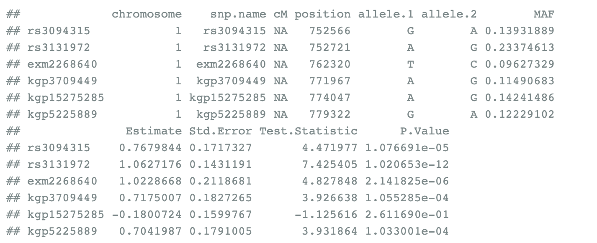
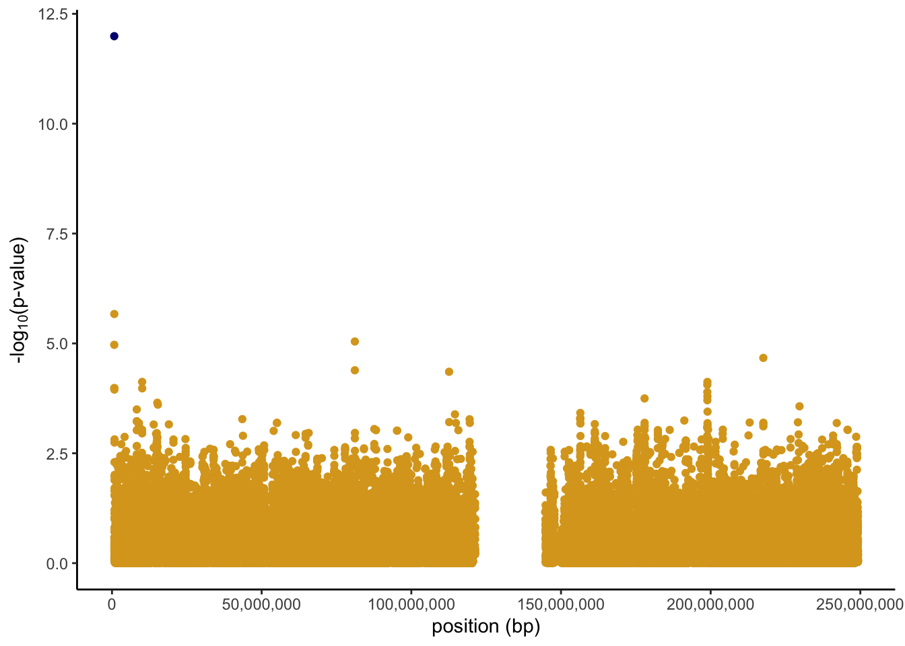

```{r setup, include=FALSE}
knitr::opts_chunk$set(echo = TRUE)
```

```{r, echo=FALSE}
library(snpStats)
library(tidyverse)
library(broom)
library(NatParksPalettes)
library(parallel)
library(GGally)   
```

On the [home page](https://statgensummary.netlify.app), I introduced **genetic variants**. We can study these genetic variants with something known as a **Genetic- Wide Association Study (GWAS)**.


Using the trait we developed in the [data section](https://statgensummary.netlify.app/data.html), we can implement **marginal regression** to run GWAS on our data.

# GWAS in RStudio

We developed our trait of interest around causal SNP, *rs3131972*, which we know to be located on chromosome 1. However, in a real genetic study we would not know where the casual SNP(s) we are looking for are located. Therefore, we’d need to run a GWAS to see if there are variants are associated with the trait and if so, where. To do this we will use *marginal regression*.

For each SNP, we will fit a model with the SNP as the single independent variable and the trait of interest as the dependent variable. Looking at our first three SNPs, the models can be created like this: 

```{r}
snp1mod <- lm(y ~ X.clean[,1])
snp2mod <- lm(y ~ X.clean[,2])
snp3mod <- lm(y ~ X.clean[,3])
```

Each of these models produces an estimate for the coefficient on the SNP. If the coefficient for  `snp1mod` is 0.33, the way we might interpret this is that for every additional minor allele (G for example) that you carry at that position, the trait of interest changes by about 0.33 units. If the trait we were measuring was height, we would expect your height to increase about 0.33 inches for every additional minor allele (a value of either 0, 1, or 2) at SNP 1.

## Analyze chromosome 1

Obviously, we cannot do the process above by hand for over one million SNPs. However, we can do this with a loop! We will start first with all SNPs located on chromosome 1. 

First, pick out these SNPs using `which()`.

```{r}
chromosome1.snps <- which(map.clean$chromosome == 1)
length(chromosome1.snps)
```

Next, loop through each of the SNPs, fitting a linear regression model at each one. For each model, we’ll record the estimates (`betas`), standard errors (`ses`), test statistics (`tstats`) and p-values (`pvals`) for the coefficient of interest, which is the slope.

```{r, eval=FALSE}
# set up empty vectors for storing the results
betas <- c()
ses <- c()
tstats <- c()
pvals <- c()

# loop through SNPs in chromosme 1
for(i in chromosome1.snps){
  # fit model
  mod <- lm(y ~ X.clean[,i])
  # get coefficient information
  coefinfo <- tidy(mod)
  # record estimate, SE, test stat, and p-value
  betas[i] <- coefinfo$estimate[2]
  ses[i] <- coefinfo$std.error[2]
  tstats[i] <- coefinfo$statistic[2]
  pvals[i] <- coefinfo$p.value[2]
}
```

After completing the loop, we add our results to our map data frame that contains information about each SNP:

```{r, eval=FALSE}
# start with the map info for the chr 1 SNPs
chr1.results <- map.clean %>%
  filter(chromosome == 1)

# then add betas, SEs, etc.
chr1.results <- chr1.results %>%
  mutate(Estimate = betas,
         Std.Error = ses,
         Test.Statistic = tstats,
         P.Value = pvals)

# look at results
head(chr1.results)
```



Lastly, we can plot the results. We take the log of the p-value in order to better identify SNPs with small p-values, and then take the negative of this to flip the plot and make it look like the typical Manhattan plot. We see a gap in the middle of the plot where the centromere of chromosome 1 is located. Centromeres are difficult to genotype so we don't get any data in this area. The causal SNP is easy to spot colored in navy blue with a $-\text{log}_{10}$(p-value) close to 12.

```{r, eval=FALSE}
chr1.results %>%
  mutate(minuslogp = -log10(P.Value), 
         causalSNP = as.factor(case_when(snp.name == "rs3131972" ~ 1, 
chr                               TRUE ~ 0))) %>%
  ggplot(aes(x = position, y = minuslogp, color = causalSNP)) +
  geom_point() + 
  scale_color_manual(values = c("goldenrod", "navy"))+
  labs(x = 'position (bp)', y = expression(paste('-log'[10],'(p-value)'))) + 
  scale_x_continuous(labels = scales::comma)+
  theme_classic()+
  theme(legend.position = "none")
```



## Analyze all chromosomes

Finally, we can analyze all chromosomes. To do this, we simply loop over the SNPs in all chromosomes instead of just those in chromosome 1.

```{r, eval=FALSE}
# set up empty vectors for storing results
betas <- c()
ses <- c()
tstats <- c()
pvals <- c()

# loop through all SNPs
for(i in 1:ncol(X.clean)){ 
  # fit model
  mod <- lm(y ~ X.clean[,i])
  # get coefficient information
  coefinfo <- tidy(mod)
  # record estimate, SE, test stat, and p-value
  betas[i] <- coefinfo$estimate[2]
  ses[i] <- coefinfo$std.error[2]
  tstats[i] <- coefinfo$statistic[2]
  pvals[i] <- coefinfo$p.value[2]
}
```

```{r, eval=FALSE}
# start with the map info for the chr 1 SNPs
all.results <- map.clean

# then add betas, SEs, etc.
all.results <- all.results %>%
  mutate(Estimate = betas,
         Std.Error = ses,
         Test.Statistic = tstats,
         P.Value = pvals)

# look at results
head(all.results)
```


When plotting the results, we make one small change to the code. Instead of plotting position along the x axis, we group with an interaction between position and chromosome. This is due to position restarting over again at each chromosome, so it prevents all the points from being plotted on top of one another.   

```{r, eval=FALSE}
all.results %>%
  mutate(minuslogp = -log10(P.Value),
         chr = as.factor(chromosome)) %>%
  ggplot(aes(x = chr, y = minuslogp, group = interaction(chr, position), color = chr)) + #interaction prevents chromosomes from overlapping
  geom_point(position = position_dodge(0.8)) +
  scale_color_manual(values=natparks.pals("DeathValley",22))+
  labs(x = 'chromosome', y = expression(paste('-log'[10],'(p-value)')))+
  theme_classic()+
  theme(legend.position = "none")
```


# GWAS in PLINK

While the process above was fairly simple, running the GWAS took over an hour on my computer and close to 30 minutes on some of Macalester's faster computers. This is where a software known as PLINK can help. PLINK is a free, open-source whole genome association analysis toolset, designed to perform a range of basic, large-scale analyses in a computationally efficient manner. We can run a GWAS in PLINK in a matter of seconds instead of minutes. 

For the purposes of demonstrating PLINK, I will simulate a trait not associated with any particular SNP, but that is associated with population structure. This will show us how a Manhattan plot with no associated SNPs compares to the one above, where we know a causal SNP exists.

To get the data ready to run in PLINK, I started by merging all 9 files (the .bim, .bam, and .fam for each of the 3 sub-populations). I listed the name of each of these files in .txt file with the structure shown in the image below. 


In the terminal and in the folder where my data was stored, I then ran the command `./plink --merge-list allfiles.txt --make-bed --out rbloggersComb`. This combines the data into one file for PLINK to analyze (`rbloggersComb`).

My next step was to create a trait in RStudio. To do this, I loaded in the data in the same way that I did in the data section, shown below. 

```{r, eval=FALSE}
load("rbloggersData/conversionTable.RData")

pathM <- paste("rbloggersData/108Malay_2527458snps", c(".bed", ".bim", ".fam"), sep = "")
SNP_M <- read.plink(pathM[1], pathM[2], pathM[3])

pathI <- paste("rbloggersData/105Indian_2527458snps", c(".bed", ".bim", ".fam"), sep = "")
SNP_I <- read.plink(pathI[1], pathI[2], pathI[3])

pathC <- paste("rbloggersData/110Chinese_2527458snps", c(".bed", ".bim", ".fam"), sep = "")
SNP_C <- read.plink(pathC[1], pathC[2], pathC[3])

rbloggers_fam <- rbind(SNP_M$fam, SNP_I$fam, SNP_C$fam)
rbloggers_map <- rbind(SNP_M$map, SNP_I$map, SNP_C$map)
```

I then selected the `pedigree` and `member` columns from the `rbloggers_fam` table and column-binded on a trait varies by population. I write this new dataset to the folder where the data is stored.

```{r}
rbloggers_poptrait <- cbind(rbloggers_fam %>% select(1:2), trait = c(rnorm(n = 108, mean = 0, sd = 1), rnorm(105, -1, sd = 1), rnorm(110, 1, 1)))
write_delim(rbloggers_poptrait, "rbloggersSep/rbloggers_poptrait")
```

In PLINK, I then run the command `./plink --bfile rbloggersComb --assoc --adjust --pheno rbloggers_poptrait --out as2`. This creates two files, one in which GWAS in ran without any adjustments and one where it is ran with adjustments. We will use the file **without adjustments**, and create a Manhattan plot using the code below.

```{r, eval=FALSE}
rbloggersSep_unadjusted <- read_table("rbloggersSep/as2.qassoc")

rbloggersSep_unadjusted_position <- rbloggersSep_unadjusted%>%
  mutate(CHR = as.integer(CHR)) %>%
  left_join(rbloggers_map %>%
              dplyr::select(snp.name, position, chromosome), by = c("SNP" = "snp.name", "CHR" = "chromosome"))
```

```{r, eval=FALSE}
rbloggersSep_adjusted_position %>%
  mutate(minuslogp = -log10(GC),
         CHR = as.factor(CHR)) %>%
  ggplot(aes(x = CHR, y = minuslogp, group = interaction(CHR, position), color = CHR)) + 
  geom_point(position = position_dodge(0.8)) + 
  labs(x = 'chromosome', y = expression(paste('-log'[10],'(p-value)')))+
  theme_classic()+
  geom_hline(yintercept = 7.245961, color = "navy", linetype = "dashed")+
  geom_hline(yintercept = 1.30103, color = "navy", linetype = "dashed")+
  scale_color_manual(values=natparks.pals("DeathValley",24))+
  theme(legend.position = "none")
```

Stuff here about how the plot varies with the original and why multiple hypothesis testing is needed. 
