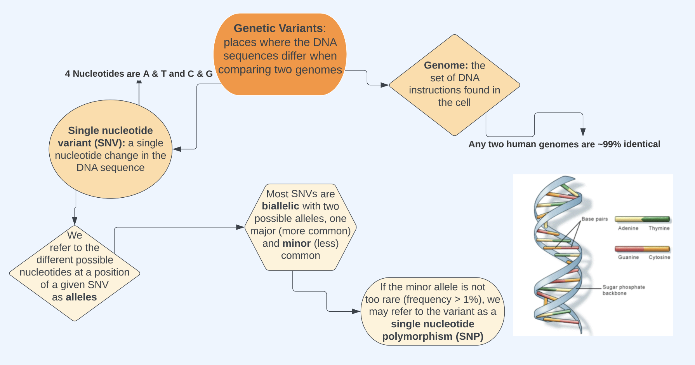

```{r setup, include=FALSE}
knitr::opts_chunk$set(echo = FALSE)
```

In this website, I talk about how to execute genetic wide association studies in RStudio and the software PLINK, multiple testing, genetic ancestry and principal component analysis, and some of the ethics behind statistical genetics. I recommend following along in the order of tabs listed above.

To get started, you'll have to have a little background on genetics. Check out the following "need-to-know" information about **genetic variants** (what the study of statistical genetics is based around).



To learn more, switch over to the [Data](https://statgensummary.netlify.app/data.html) tab!

### Acknowledgements

I would like to give a big thank you to my professor Kelsey Grinde for making this website possible and getting me interested in the field of statistical genetics :)
